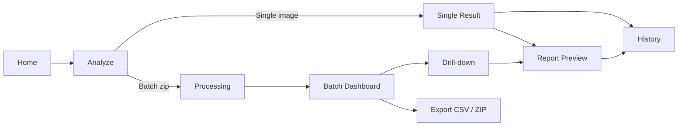

# UI Wireframes — Explainable AI Fingerprint Spoof Detection System

**Project:** Explainable AI-Based Fingerprint Spoof Detection System for Digital Forensics
**Author:** K. M. Pasindu Chanuka Elapatha
**Document version:** v1.0 (initial wireframe pass)
**Last updated:** 2026-04-23
**Visual style:** Forensic-lab dark mode
**Target framework:** Streamlit
**Folder upload:** Zip-based (single .zip drop)

---

## Table of Contents

1. [Design tokens (colors, type, spacing)](#1-design-tokens)
2. [Global layout & navigation](#2-global-layout--navigation)
3. [User flows](#3-user-flows)
4. [Screen 1 — Home / Landing](#screen-1--home--landing)
5. [Screen 2 — Analyze (Upload)](#screen-2--analyze-upload)
6. [Screen 3 — Processing](#screen-3--processing)
7. [Screen 4 — Batch Dashboard](#screen-4--batch-dashboard)
8. [Screen 5 — Single Result](#screen-5--single-result)
9. [Screen 6 — Drill-down (from batch)](#screen-6--drill-down-from-batch)
10. [Screen 7 — Report Preview](#screen-7--report-preview)
11. [Screen 8 — History](#screen-8--history)
12. [Screen 9 — About / Methodology](#screen-9--about--methodology)
13. [Screen 10 — XAI Comparison](#screen-10--xai-comparison)
14. [Component inventory](#14-component-inventory)
15. [Accessibility & forensic-domain considerations](#15-accessibility--forensic-domain-considerations)

---

## 1. Design tokens

A small, deliberate palette. Forensic tools should feel like **lab instruments**, not consumer apps — minimal color, high information density, monospace for technical readouts.

### Colors

| Token | Hex | Use |
|---|---|---|
| `bg.base` | `#0B0F14` | App background (near-black, easy on eyes during long sessions) |
| `bg.surface` | `#141B23` | Cards, panels, table rows |
| `bg.elevated` | `#1C2530` | Modals, dropdowns, hover states |
| `border.subtle` | `#2A3441` | Card outlines, dividers |
| `border.strong` | `#3D4A5C` | Active inputs, focused elements |
| `text.primary` | `#E6EDF3` | Body text, headings |
| `text.secondary` | `#8B949E` | Labels, metadata, helper text |
| `text.muted` | `#6E7681` | Disabled, timestamps |
| `accent.live` | `#3FB950` | Live verdicts, success states (green) |
| `accent.spoof` | `#F85149` | Spoof verdicts, errors (red) |
| `accent.warn` | `#D29922` | Warnings, low quality, anomalies (amber) |
| `accent.info` | `#58A6FF` | Primary actions, links (cyan-blue) |
| `accent.neutral` | `#A371F7` | XAI / explanation accents (violet) |

**Heatmap palette:** viridis (`#440154` → `#21908C` → `#FDE725`) — colorblind-safe, scientifically standard for attribution maps.

### Typography

| Token | Font | Use |
|---|---|---|
| `font.body` | Inter, system-ui, sans-serif | Body, headings |
| `font.mono` | JetBrains Mono, ui-monospace | Case IDs, scores, timestamps, JSON readouts |

### Spacing scale (px)

`4 · 8 · 12 · 16 · 24 · 32 · 48 · 64`

### Borders & radii

- Card radius: `8px`
- Button radius: `6px`
- Image preview radius: `4px`
- Stroke width: `1px` everywhere; never thicker

---

## 2. Global layout & navigation

Persistent across every screen.

```
┌──────────────────────────────────────────────────────────────────────────────┐
│  ▣ FSD-XAI    Home   Analyze   History   About   Compare        ⚙  v1.0.0   │  ← Top nav (56px)
├──────────────────────────────────────────────────────────────────────────────┤
│                                                                              │
│                            < Page content >                                  │
│                                                                              │
├──────────────────────────────────────────────────────────────────────────────┤
│  Model: ResNet50V2-CBAM · Build a3f9b21 · LivDet 2013 · GPU: T4              │  ← Status bar (32px)
└──────────────────────────────────────────────────────────────────────────────┘
```

**Top nav rules**
- Logo `▣ FSD-XAI` is a "Home" shortcut.
- Active link gets a 2px underline in `accent.info`.
- `⚙` opens a settings drawer (model picker, threshold, theme — all optional features).
- Version pill on right is read-only; clickable for a build-info modal.

**Status bar rules**
- Always present so examiners know exactly which model produced a result. This is **forensic provenance** — non-negotiable.
- Monospace, low-contrast.

**Notifications**
- Toast bottom-right for non-blocking events (file upload accepted, report saved).
- Inline banner at top of content area for errors that block the action.

---

## 3. User flows

Two primary flows. All other screens are reachable from the top nav.

### Flow A — Single image analysis

```
Home → Analyze (Single tab) → Single Result → Report Preview → Download PDF
                                    ↓
                              History (auto-saved)
```

### Flow B — Batch analysis (zip)

```
Home → Analyze (Batch tab) → Processing → Batch Dashboard → Drill-down → Report Preview
                                              │                  │
                                              │                  └→ back to Batch Dashboard
                                              └→ Export CSV / ZIP of reports
```

**Mermaid version (for thesis):**



---

## Screen 1 — Home / Landing

**Purpose.** First impression for examiners. Communicate what the system does in ≤5 seconds. Provide two clear actions.

**Entry points.** Direct URL, logo click from any page.

**Exit points.** Top nav, "Start Analysis" CTA → Screen 2.

### Layout

```
┌──────────────────────────────────────────────────────────────────────────────┐
│  ▣ FSD-XAI    Home   Analyze   History   About   Compare        ⚙  v1.0.0   │
├──────────────────────────────────────────────────────────────────────────────┤
│                                                                              │
│                                                                              │
│              Explainable Fingerprint Spoof Detection                         │  ← H1 (32px)
│                          for Digital Forensics                               │
│                                                                              │
│        Detect silicone, gelatin, and latex spoofs with                       │  ← subtitle (16px, secondary)
│        court-ready visual explanations powered by Grad-CAM++,                │
│        SHAP, and LIME.                                                       │
│                                                                              │
│              ┌─────────────────────┐  ┌─────────────────────┐                │
│              │  ▶  Start Analysis  │  │  📖 Methodology      │                │
│              └─────────────────────┘  └─────────────────────┘                │
│                  (primary, info)         (secondary, outline)                │
│                                                                              │
│  ┌────────────────────────┐ ┌────────────────────────┐ ┌──────────────────┐  │
│  │  🛡  Spoof Detection    │ │  🔬 Forensic XAI       │ │  📑 Court-ready  │  │
│  │                        │ │                        │ │     Reports      │  │
│  │  CNN with attention,   │ │  Grad-CAM++, SHAP,     │ │  PDF with        │  │
│  │  >95% AUC on LivDet.   │ │  LIME — comparable     │ │  Daubert/Frye    │  │
│  │                        │ │  faithfulness scores.  │ │  alignment.      │  │
│  └────────────────────────┘ └────────────────────────┘ └──────────────────┘  │
│                                                                              │
│  Trained on LivDet 2013 · MSU-FPAD v2 · CrossMatch 300 · Biometrika 400B     │  ← caption
│                                                                              │
├──────────────────────────────────────────────────────────────────────────────┤
│  Model: ResNet50V2-CBAM · Build a3f9b21 · LivDet 2013 · GPU: T4              │
└──────────────────────────────────────────────────────────────────────────────┘
```

### Components used
- `nav.top`
- `hero.heading` (H1 + subtitle + 2 CTA buttons)
- `card.feature` × 3 (icon + title + 1-line description)
- `caption.dataset_strip`
- `statusbar.global`

### States
- **Default.** Shown above.
- **First-visit (optional v1.1).** A dismissible banner: *"This is a research prototype. Not validated for operational forensic use."*

### Notes for thesis
This screen is a marketing wrapper, but the dataset strip and version footer are evidence of **provenance** — useful viva talking point.

---

## Screen 2 — Analyze (Upload)

**Purpose.** Accept a single image OR a zip of images and the case metadata. This is the most-used screen.

**Entry points.** Top nav `Analyze`, Home `Start Analysis` CTA.

**Exit points.**
- Single submission → Screen 5 (Single Result)
- Batch submission → Screen 3 (Processing)

### Layout

```
┌──────────────────────────────────────────────────────────────────────────────┐
│  ▣ FSD-XAI    Home   Analyze   History   About   Compare        ⚙  v1.0.0   │
├──────────────────────────────────────────────────────────────────────────────┤
│  Analyze Fingerprint                                                         │  ← page title
│  Upload a single image or a zip archive for batch analysis.                  │
│                                                                              │
│  ┌──────────────────────────────────────────────────────────────────────┐    │
│  │   Single Image    │  Batch (.zip)                                    │    │  ← tabs
│  └──────────────────────────────────────────────────────────────────────┘    │
│                                                                              │
│  ┌─────────────────────────────────────────┐  ┌──────────────────────────┐   │
│  │                                         │  │  Case Metadata           │   │
│  │           ┌────────────┐                │  │                          │   │
│  │           │     ⬆      │                │  │  Case ID *               │   │
│  │           └────────────┘                │  │  ┌────────────────────┐  │   │
│  │                                         │  │  │ CASE-2026-0042     │  │   │
│  │     Drop image or zip here              │  │  └────────────────────┘  │   │
│  │     or click to browse                  │  │                          │   │
│  │                                         │  │  Examiner *              │   │
│  │     Accepted: .png .jpg .bmp .tif       │  │  ┌────────────────────┐  │   │
│  │     Max: 50 MB (zip) / 10 MB (single)   │  │  │ P. Elapatha        │  │   │
│  │                                         │  │  └────────────────────┘  │   │
│  │                                         │  │                          │   │
│  │                                         │  │  Sensor                  │   │
│  │                                         │  │  ┌────────────────────┐  │   │
│  │                                         │  │  │ Biometrika 400B  ▼ │  │   │
│  │                                         │  │  └────────────────────┘  │   │
│  │                                         │  │                          │   │
│  │                                         │  │  Notes (optional)        │   │
│  │                                         │  │  ┌────────────────────┐  │   │
│  │                                         │  │  │                    │  │   │
│  │                                         │  │  │                    │  │   │
│  │                                         │  │  └────────────────────┘  │   │
│  │                                         │  │                          │   │
│  └─────────────────────────────────────────┘  └──────────────────────────┘   │
│                                                                              │
│  ┌────────────────────────────────────────────────────────────────────────┐  │
│  │  ✓ fingerprints_2026-04.zip   ·   247 files · 18.4 MB                   │  │  ← appears after upload
│  │      Validated formats: 245 images, 2 ignored (.txt, .md)               │  │
│  └────────────────────────────────────────────────────────────────────────┘  │
│                                                                              │
│                                            ┌────────────────────────────┐    │
│                                            │  ▶  Start Analysis (245)   │    │
│                                            └────────────────────────────┘    │
│                                                  (primary, info)             │
├──────────────────────────────────────────────────────────────────────────────┤
│  Model: ResNet50V2-CBAM · Build a3f9b21 · LivDet 2013 · GPU: T4              │
└──────────────────────────────────────────────────────────────────────────────┘
```

### Tab differences

| Tab | Drop zone accepts | Validation |
|---|---|---|
| **Single Image** | `.png .jpg .jpeg .bmp .tif .tiff` (one file, ≤10 MB) | Decode check, dimension check (50–4096 px) |
| **Batch (.zip)** | `.zip` (≤50 MB) | Unzip in memory, count valid images, show ignored count |

### Single-image preview state

When a single image is uploaded, the drop zone is replaced by a preview thumbnail at 256×256, with a "Replace" link top-right.

### Form fields

| Field | Required | Type | Validation |
|---|---|---|---|
| Case ID | yes | text, monospace | regex `[A-Z0-9-]{3,32}`; auto-suggested as `CASE-YYYY-####` |
| Examiner | yes | text | 2–80 chars |
| Sensor | no | select | Biometrika 400B / CrossMatch 300 / Digital Persona / Other / Unknown |
| Notes | no | textarea | ≤500 chars |

### States
- **Empty.** Drop zone empty, "Start Analysis" disabled.
- **File loaded.** File summary card visible, "Start Analysis" enabled.
- **Validation error.** Red banner under drop zone: *"`xyz.txt` is not a supported image format and will be skipped."* — but only when the *whole* upload is invalid; partial validity is allowed for zips.
- **Submitting.** Button shows spinner; form disabled.

### Edge cases
- Zip contains nested folders → flatten on extraction; preserve filename for the manifest.
- Zip contains duplicate filenames → suffix with `_1`, `_2`.
- TIFF with multiple pages → use page 0, log a warning in the per-image notes column.
- Corrupt image → still appear in the results table with status `Failed to read`.

---

## Screen 3 — Processing

**Purpose.** Show the user that work is happening, how much remains, and let them cancel. Only shown for batch submissions.

**Entry point.** Screen 2 → Start Analysis (with .zip).

**Exit points.**
- Auto-redirect to Screen 4 when processing completes.
- "Cancel" → Screen 2 with toast confirmation.

### Layout

```
┌──────────────────────────────────────────────────────────────────────────────┐
│  ▣ FSD-XAI    Home   Analyze   History   About   Compare        ⚙  v1.0.0   │
├──────────────────────────────────────────────────────────────────────────────┤
│  Processing Batch                                                            │
│  CASE-2026-0042 · 245 images                                                 │
│                                                                              │
│                                                                              │
│           ┌────────────────────────────────────────────────────┐             │
│           │ ███████████████████░░░░░░░░░░░░░░░░░░░░░░░  47%   │             │  ← progress bar
│           └────────────────────────────────────────────────────┘             │
│                                                                              │
│              115 / 245 images          ETA: 1m 42s                           │
│              Throughput: 1.3 imgs/s    Elapsed: 1m 28s                       │
│                                                                              │
│                            ┌──────────────┐                                  │
│                            │   ✕ Cancel    │                                  │
│                            └──────────────┘                                  │
│                                                                              │
│  ──────────────────────────────────────────────────────────────────────────  │
│  Recent results                                                              │  ← live tail
│                                                                              │
│  ┌──────────────────────────────────────────────────────────────────────┐    │
│  │ #   Filename             Verdict   Conf    Quality   Time    Status  │    │
│  │ 115 fp_113_silicone.png  SPOOF     0.94    78        62ms    ✓       │    │
│  │ 114 fp_112_live.png      LIVE      0.97    82        58ms    ✓       │    │
│  │ 113 fp_111_corrupt.tif   —         —       —         —       ⚠ FAIL  │    │
│  │ 112 fp_110_live.png      LIVE      0.91    71        61ms    ✓       │    │
│  │ 111 fp_109_gelatin.bmp   SPOOF     0.88    66        59ms    ✓       │    │
│  └──────────────────────────────────────────────────────────────────────┘    │
│                                                                              │
├──────────────────────────────────────────────────────────────────────────────┤
│  Model: ResNet50V2-CBAM · Build a3f9b21 · LivDet 2013 · GPU: T4              │
└──────────────────────────────────────────────────────────────────────────────┘
```

### Components used
- `progress.bar` (animated, accent.info fill on bg.surface track)
- `stats.row` (counter + ETA + throughput)
- `button.danger_outline` (Cancel — outlined, not solid, to discourage accidental clicks)
- `table.live_tail` (auto-scrolls; shows last 5 only)

### States
- **Running.** Default state above.
- **Stalled** (no progress for 30s). Banner: *"Processing slower than expected. Click to view diagnostics."* — non-blocking.
- **Cancelled.** Confirmation modal *"Cancel batch? Already-processed results (114) will be saved to History."* → Yes/No.
- **Completed.** Auto-redirect to Screen 4 with toast: *"Batch complete. 245 processed, 1 failed."*

### Notes
- Cancel preserves partial results — never throw away work.
- Failed rows must still appear in the final dashboard so the examiner can re-upload them.

---

## Screen 4 — Batch Dashboard

**Purpose.** Aggregate view of an entire batch. Lets examiners triage hundreds of images quickly.

**Entry points.** Screen 3 (auto), History (Screen 8) on a batch row.

**Exit points.** Click a table row → Screen 6 (Drill-down). Export buttons. Top nav.

### Layout

```
┌──────────────────────────────────────────────────────────────────────────────┐
│  ▣ FSD-XAI    Home   Analyze   History   About   Compare        ⚙  v1.0.0   │
├──────────────────────────────────────────────────────────────────────────────┤
│  Batch Dashboard                              ⬇ Export CSV   ⬇ Export ZIP    │
│  CASE-2026-0042 · P. Elapatha · 2026-04-23 14:32 · 245 images                │
│                                                                              │
│  ┌──────────────────┐ ┌──────────────────┐ ┌──────────────────┐ ┌──────────┐ │
│  │  Total           │ │  Live            │ │  Spoof           │ │  Failed  │ │
│  │                  │ │                  │ │                  │ │          │ │
│  │      245         │ │      132 (54%)   │ │      112 (46%)   │ │     1    │ │
│  │                  │ │  ▰▰▰▰▰▰▱▱▱▱     │ │  ▰▰▰▰▰▱▱▱▱▱     │ │          │ │
│  └──────────────────┘ └──────────────────┘ └──────────────────┘ └──────────┘ │
│   (text.primary)       (accent.live)       (accent.spoof)       (warn)       │
│                                                                              │
│  ┌──────────────────┐ ┌──────────────────┐ ┌──────────────────┐              │
│  │  Avg Confidence  │ │  Low Quality     │ │  Anomalies       │              │
│  │      0.91        │ │      14 (6%)     │ │      3           │              │
│  └──────────────────┘ └──────────────────┘ └──────────────────┘              │
│                                                                              │
│  ──────────────────────────────────────────────────────────────────────────  │
│                                                                              │
│  🔍 Search filename...    Verdict: [All ▼]  Quality: [All ▼]  ☐ Anomaly     │
│  Sort by: [Confidence ▼]  ⇅                                                  │
│                                                                              │
│  ┌──────────────────────────────────────────────────────────────────────┐    │
│  │ □ #   Filename            Verdict  Conf   NFIQ2  Anomaly  Material   │    │
│  ├──────────────────────────────────────────────────────────────────────┤    │
│  │ □ 1   fp_001_live.png     LIVE     0.98   88     —        —         →│    │
│  │ □ 2   fp_002_silic.png    SPOOF    0.96   71     —        Silicone  →│    │
│  │ □ 3   fp_003_gelat.bmp    SPOOF    0.94   66     —        Gelatin   →│    │
│  │ □ 4   fp_004_live.tif     LIVE     0.93   54     —        —         →│    │
│  │ □ 5   fp_005_unkno.png    SPOOF    0.71   48     ⚠         Unknown  →│    │
│  │ □ 6   fp_006_corr.tif     FAIL     —      —      —        —         →│    │
│  │ ...                                                                   │    │
│  └──────────────────────────────────────────────────────────────────────┘    │
│                                                                              │
│        ◀ Prev   Page 1 of 25 (10/page)   Next ▶              Show: [10 ▼]   │
│                                                                              │
│  With selected: [Generate Reports ▼]  [Re-analyze]  [Mark for Review]        │  ← bulk actions (when ≥1 selected)
│                                                                              │
├──────────────────────────────────────────────────────────────────────────────┤
│  Model: ResNet50V2-CBAM · Build a3f9b21 · LivDet 2013 · GPU: T4              │
└──────────────────────────────────────────────────────────────────────────────┘
```

### Components used
- `card.metric` × 7 (Total, Live, Spoof, Failed, Avg Confidence, Low Quality, Anomalies)
- `filter.bar` (search, dropdowns, checkbox)
- `table.results` (sortable columns, pagination, row checkboxes)
- `button.export` × 2 (CSV, ZIP)
- `button.bulk_action` (visible only when rows selected)

### Table column rules

| Column | Sortable | Notes |
|---|---|---|
| `□` | no | Multi-select checkbox |
| `#` | yes | Sequence in batch |
| Filename | yes | Truncated with tooltip on hover |
| Verdict | yes | Pill badge: green/red/amber/gray |
| Conf | yes | Numeric, 2dp, monospace |
| NFIQ2 | yes | Numeric + colored dot (green ≥60, amber 30–59, red <30) |
| Anomaly | yes | `⚠` if flagged, blank otherwise |
| Material | yes | Predicted spoof material (only for SPOOF rows) |
| `→` | no | Click to drill down |

### States
- **Empty batch (edge case).** "No results yet." with re-analyze CTA.
- **Filter applied.** Result count updates: *"Showing 24 of 245."*
- **Multi-select.** Bulk action bar appears at bottom.
- **Failed rows.** Yellow row tint; `→` opens a "Why did this fail?" detail modal instead of normal drill-down.

### Export behaviors
- **CSV** = current filtered+sorted view, all metadata, no images.
- **ZIP** = per-image PDF reports + `summary.csv` + `manifest.json`.

---

## Screen 5 — Single Result

**Purpose.** The full forensic view of one fingerprint. Used both for single-image submissions and (via Screen 6) for drill-down from a batch.

**Entry points.** Screen 2 (single submission), Screen 6 (drill-down — same layout, with extra nav controls).

**Exit points.** Generate Report → Screen 7. Top nav.

### Layout

```
┌──────────────────────────────────────────────────────────────────────────────┐
│  ▣ FSD-XAI    Home   Analyze   History   About   Compare        ⚙  v1.0.0   │
├──────────────────────────────────────────────────────────────────────────────┤
│  Result · CASE-2026-0042 · fp_002_silicone.png                               │
│  Examined by P. Elapatha · 2026-04-23 14:32:15                               │
│                                                                              │
│  ┌──────────────────────────────────┐  ┌─────────────────────────────────┐   │
│  │                                  │  │  ┌───────────────────────────┐  │   │
│  │                                  │  │  │  VERDICT                  │  │   │
│  │                                  │  │  │                           │  │   │
│  │                                  │  │  │       SPOOF               │  │   │
│  │       [original image]           │  │  │       0.94 confidence     │  │   │
│  │       (max 480x480, fit)         │  │  │                           │  │   │
│  │                                  │  │  │  Predicted material:      │  │   │
│  │                                  │  │  │  Silicone (0.81)          │  │   │
│  │                                  │  │  └───────────────────────────┘  │   │
│  │                                  │  │  (border: accent.spoof)         │   │
│  │                                  │  │                                 │   │
│  │                                  │  │  ┌───────────────────────────┐  │   │
│  │                                  │  │  │  QUALITY                  │  │   │
│  │                                  │  │  │  NFIQ2: 71  ●  Medium     │  │   │
│  │                                  │  │  └───────────────────────────┘  │   │
│  │                                  │  │                                 │   │
│  │                                  │  │  ┌───────────────────────────┐  │   │
│  │                                  │  │  │  ANOMALY DETECTOR         │  │   │
│  │                                  │  │  │  Known pattern  ✓         │  │   │
│  │                                  │  │  │  IsoForest score: 0.21    │  │   │
│  │                                  │  │  │  VAE recon error: 0.034   │  │   │
│  │                                  │  │  └───────────────────────────┘  │   │
│  │                                  │  │                                 │   │
│  │  Sensor: Biometrika 400B         │  │  ┌───────────────────────────┐  │   │
│  │  Resolution: 500 DPI · 480x640   │  │  │  TIMING                   │  │   │
│  │  Format: PNG                     │  │  │  Preprocess:    48 ms     │  │   │
│  └──────────────────────────────────┘  │  │  Inference:     82 ms     │  │   │
│                                        │  │  XAI total:   3.21 s      │  │   │
│                                        │  │  Total:       3.34 s      │  │   │
│                                        │  └───────────────────────────┘  │   │
│                                        └─────────────────────────────────┘   │
│                                                                              │
│  ──────────────────────────────────────────────────────────────────────────  │
│                                                                              │
│  Explanation                                                                 │
│  ┌──────────────────────────────────────────────────────────────────────┐    │
│  │  Grad-CAM++  │  SHAP  │  LIME  │  All (split view)                   │    │  ← tabs
│  └──────────────────────────────────────────────────────────────────────┘    │
│                                                                              │
│  ┌──────────────────────────────────────────────────────────────────────┐    │
│  │                                                                      │    │
│  │           [original]               [heatmap overlay]                 │    │
│  │           480x480                  480x480, viridis                  │    │
│  │                                                                      │    │
│  │   Color scale: ░ low ──── █ high   Top-1 region: central ridge       │    │
│  │                                                                      │    │
│  │   Plain-language summary:                                            │    │
│  │   "Grad-CAM++ flagged abnormal ridge continuity in the central       │    │
│  │   region (peak attribution 0.87) as the strongest spoof indicator,   │    │
│  │   consistent with silicone-cast artifacts."                          │    │
│  │                                                                      │    │
│  │   Faithfulness score: 0.78  (deletion AUC method)                    │    │
│  └──────────────────────────────────────────────────────────────────────┘    │
│                                                                              │
│  ┌──────────────────┐  ┌──────────────────┐  ┌──────────────────┐            │
│  │  📑 Generate PDF │  │  🔬 Compare All  │  │  💾 Save to Hist │            │
│  └──────────────────┘  └──────────────────┘  └──────────────────┘            │
│   (primary, info)       (secondary)           (secondary)                    │
│                                                                              │
├──────────────────────────────────────────────────────────────────────────────┤
│  Model: ResNet50V2-CBAM · Build a3f9b21 · LivDet 2013 · GPU: T4              │
└──────────────────────────────────────────────────────────────────────────────┘
```

### Verdict card variations

| Verdict | Border | Headline color |
|---|---|---|
| LIVE | `accent.live` | `accent.live` |
| SPOOF | `accent.spoof` | `accent.spoof` |
| LOW CONFIDENCE (0.5±0.1) | `accent.warn` | `accent.warn` + caveat text *"Borderline — re-capture recommended."* |

### XAI tab states

| Tab | Shows | Loading priority |
|---|---|---|
| Grad-CAM++ | Heatmap + plain-language summary + faithfulness | First (fast, ~100ms) |
| SHAP | Attribution overlay (red=positive, blue=negative) + top-5 patches | Second (~3s) |
| LIME | Superpixel overlay + top regions | Third (~5s) |
| All | 2×2 grid: original + 3 XAI thumbnails | After all loaded |

While SHAP/LIME compute, those tabs show a skeleton loader with text *"Computing SHAP... ~3s"*.

### States
- **All XAI loaded.** Default.
- **XAI loading (asynchronous).** Each tab independently shows a spinner.
- **XAI failed.** Single tab shows fallback: *"Could not compute SHAP for this image. [Retry]"* — does not block other tabs.
- **Anomaly flagged.** Anomaly card border becomes `accent.warn`; banner above explanation: *"Anomaly detector flagged this as an unusual pattern. The verdict is provisional."*

---

## Screen 6 — Drill-down (from batch)

**Purpose.** Review one image from a batch in full detail without losing batch context. Same body as Screen 5, with breadcrumb + Prev/Next navigation.

**Entry point.** Click row in Screen 4.

**Exit points.** Back to batch (breadcrumb), Prev/Next within batch, top nav.

### Layout (delta from Screen 5)

Only the header strip differs; everything below is identical to Screen 5.

```
├──────────────────────────────────────────────────────────────────────────────┤
│  ◀ Back to batch  ·  CASE-2026-0042 / fp_002_silicone.png                    │  ← breadcrumb
│                                                                              │
│  Image 2 of 245                          ◀ Previous   Next ▶                 │  ← nav row
│  ──────────────────────────────────────────────────────────────────────────  │
│  ... (Screen 5 layout below) ...                                             │
```

### Keyboard shortcuts (forensic-friendly)

- `←` / `→` Previous / Next image in batch
- `R` Generate report for current image
- `Esc` Back to batch dashboard

Show a small `⌨` icon top-right that opens a shortcut cheat sheet.

### States
- **First image.** "Previous" disabled.
- **Last image.** "Next" disabled, plus toast *"You've reviewed all images."*
- **Filtered batch.** Prev/Next respect the active filter on Screen 4.

---

## Screen 7 — Report Preview

**Purpose.** Show the generated forensic report exactly as it will be delivered. Confirm before download.

**Entry points.** "Generate PDF" button on Screen 5 / Screen 6, "Generate Reports" bulk action on Screen 4.

**Exit points.** Download PDF, "Email" (mock for thesis), Back.

### Layout

```
┌──────────────────────────────────────────────────────────────────────────────┐
│  ▣ FSD-XAI    Home   Analyze   History   About   Compare        ⚙  v1.0.0   │
├──────────────────────────────────────────────────────────────────────────────┤
│  Report Preview                                                              │
│  CASE-2026-0042 · fp_002_silicone.png · Generated 2026-04-23 14:34:02        │
│                                                                              │
│  ┌────────────────────────────┐  ┌────────────────────────────────────────┐  │
│  │   Report Pages             │  │                                        │  │
│  │                            │  │   ┌──────────────────────────────┐     │  │
│  │   ┌─────────┐              │  │   │                              │     │  │
│  │   │ Page 1  │  ← active    │  │   │     [PDF page rendering]     │     │  │
│  │   │ Header  │              │  │   │                              │     │  │
│  │   └─────────┘              │  │   │  Forensic Spoof Detection    │     │  │
│  │                            │  │   │  Report                      │     │  │
│  │   ┌─────────┐              │  │   │                              │     │  │
│  │   │ Page 2  │              │  │   │  Case ID: CASE-2026-0042     │     │  │
│  │   │ Image + │              │  │   │  Examiner: P. Elapatha       │     │  │
│  │   │ verdict │              │  │   │  Date: 2026-04-23 14:32      │     │  │
│  │   └─────────┘              │  │   │                              │     │  │
│  │                            │  │   │  ─────────────────────────   │     │  │
│  │   ┌─────────┐              │  │   │                              │     │  │
│  │   │ Page 3  │              │  │   │  CLASSIFICATION: SPOOF       │     │  │
│  │   │ XAI     │              │  │   │  Confidence: 0.94            │     │  │
│  │   └─────────┘              │  │   │                              │     │  │
│  │                            │  │   │  Predicted material:         │     │  │
│  │   ┌─────────┐              │  │   │  Silicone (0.81)             │     │  │
│  │   │ Page 4  │              │  │   │                              │     │  │
│  │   │ Method  │              │  │   │  Quality (NFIQ2): 71         │     │  │
│  │   │ + sigs  │              │  │   │                              │     │  │
│  │   └─────────┘              │  │   │  ...                         │     │  │
│  │                            │  │   └──────────────────────────────┘     │  │
│  │                            │  │                                        │  │
│  │                            │  │   ◀  Page 2 of 4  ▶    🔍 Zoom: 100%  │  │
│  └────────────────────────────┘  └────────────────────────────────────────┘  │
│                                                                              │
│  ┌──────────────────────────────────────────────────────────────────────┐    │
│  │  Report includes:  Case header  ✓   Image  ✓   Grad-CAM++  ✓         │    │
│  │                    SHAP  ✓   LIME  ✓   Methodology  ✓   Signatures  ✓│    │
│  └──────────────────────────────────────────────────────────────────────┘    │
│                                                                              │
│  ┌──────────────────┐  ┌──────────────────┐  ┌──────────────────┐            │
│  │  ⬇ Download PDF  │  │  ✉  Email (mock) │  │  ◀ Back          │            │
│  └──────────────────┘  └──────────────────┘  └──────────────────┘            │
│                                                                              │
├──────────────────────────────────────────────────────────────────────────────┤
│  Model: ResNet50V2-CBAM · Build a3f9b21 · LivDet 2013 · GPU: T4              │
└──────────────────────────────────────────────────────────────────────────────┘
```

### Components used
- `pdf.thumbnail_strip` (left)
- `pdf.viewer` (right — Streamlit `st.pdf` or fallback iframe)
- `report.checklist` (read-only verification of contents)
- `button.download` (primary)
- `button.email_mock` (opens disabled modal explaining "feature reserved for production")

### Report PDF structure (4 pages)

| Page | Content |
|---|---|
| 1 | Header: case ID, examiner, date, model + commit, dataset versions |
| 2 | Original image + verdict + quality + anomaly + plain-language conclusion |
| 3 | All three XAI overlays + faithfulness scores + per-method summary |
| 4 | Methodology summary + Daubert/Frye admissibility note + signature blocks |

### States
- **Generating.** Spinner with *"Composing PDF... ~500ms"*.
- **Generated.** Default state above.
- **Generation failed.** Error card with *"Couldn't render PDF. [Retry] [Report bug]"*.

---

## Screen 8 — History

**Purpose.** Persistent list of all past analyses (single + batch). Lets examiners pick up unfinished work and re-open results.

**Entry point.** Top nav `History`.

**Exit points.** Click row → Screen 4 (batch) or Screen 5 (single).

### Layout

```
┌──────────────────────────────────────────────────────────────────────────────┐
│  ▣ FSD-XAI    Home   Analyze   History   About   Compare        ⚙  v1.0.0   │
├──────────────────────────────────────────────────────────────────────────────┤
│  History                                                                     │
│  All past analyses on this device.                                           │
│                                                                              │
│  🔍 Search case ID or filename...    Type: [All ▼]   Date: [Last 30 days ▼] │
│                                                                              │
│  ┌──────────────────────────────────────────────────────────────────────┐    │
│  │ Date         Case ID            Type    Items  Live  Spoof  Status   │    │
│  ├──────────────────────────────────────────────────────────────────────┤    │
│  │ 2026-04-23   CASE-2026-0042     Batch   245    132   112    Done    →│    │
│  │ 2026-04-23   CASE-2026-0041     Single  1      0     1      Done    →│    │
│  │ 2026-04-22   CASE-2026-0039     Batch   80     45    35     Done    →│    │
│  │ 2026-04-22   CASE-2026-0038     Batch   120    —     —      Cancel.→ │    │
│  │ 2026-04-21   CASE-2026-0037     Single  1      1     0      Done    →│    │
│  │ ...                                                                   │    │
│  └──────────────────────────────────────────────────────────────────────┘    │
│                                                                              │
│       ◀ Prev   Page 1 of 8 (15/page)   Next ▶                                │
│                                                                              │
│  Bulk: [Delete Selected]  [Export Index CSV]                                 │
│                                                                              │
├──────────────────────────────────────────────────────────────────────────────┤
│  Model: ResNet50V2-CBAM · Build a3f9b21 · LivDet 2013 · GPU: T4              │
└──────────────────────────────────────────────────────────────────────────────┘
```

### Storage note
- For thesis demo, history can live in browser session state (cleared on refresh).
- For production-ish polish, use a local SQLite file at `~/.fsd_xai/history.db`.

### States
- **Empty.** Centered illustration + *"No analyses yet. Start one →"*.
- **Cancelled batch row.** Clicking it goes to Screen 4 with a banner *"This batch was cancelled. Some images were not analyzed."*

---

## Screen 9 — About / Methodology

**Purpose.** Forensic transparency. Anyone — including a judge or examiner — must be able to read this and understand what the system does, what it was trained on, and what it cannot do.

**Entry point.** Top nav `About`, Home `Methodology` CTA.

**Exit points.** Top nav.

### Layout

```
┌──────────────────────────────────────────────────────────────────────────────┐
│  ▣ FSD-XAI    Home   Analyze   History   About   Compare        ⚙  v1.0.0   │
├──────────────────────────────────────────────────────────────────────────────┤
│                                                                              │
│   ┌──────────────────────────────────────────────────────────────────────┐   │
│   │ On this page                                                         │   │  ← sticky TOC, left
│   │ • Overview                                                           │   │
│   │ • How it works                                                       │   │
│   │ • Datasets                                                           │   │
│   │ • Model                                                              │   │
│   │ • XAI methods                                                        │   │
│   │ • Limitations                                                        │   │
│   │ • Forensic admissibility                                             │   │
│   │ • References                                                         │   │
│   └──────────────────────────────────────────────────────────────────────┘   │
│                                                                              │
│   Overview                                                                   │
│   This system detects spoofed fingerprints (silicone, gelatin, latex, ...)   │
│   using a convolutional neural network with attention, and explains its      │
│   decisions using three XAI techniques: Grad-CAM++, SHAP, and LIME.          │
│                                                                              │
│   How it works                                                               │
│   ┌──────────────────────────────────────────────────────────────────────┐   │
│   │  [Embedded architecture diagram from docs/diagrams/architecture.svg] │   │
│   └──────────────────────────────────────────────────────────────────────┘   │
│   1. The image is preprocessed (ROI extraction, CLAHE, normalization).       │
│   2. A CNN classifies live vs. spoof.                                        │
│   3. Three XAI methods generate explanations.                                │
│   4. A forensic report is composed.                                          │
│                                                                              │
│   Datasets                                                                   │
│   Trained on LivDet 2013 (intra), evaluated on LivDet 2015 (cross-dataset)   │
│   and MSU-FPAD v2 (zero-day, leave-one-material-out).                        │
│                                                                              │
│   Model                                                                      │
│   ┌──────────────────────────────────────────────────────────────────────┐   │
│   │  Architecture:    ResNet50V2 + CBAM attention                        │   │
│   │  Backbone alt:    MobileNetV3 (faster)                               │   │
│   │  Anomaly branch:  IsolationForest + Variational Autoencoder          │   │
│   │  Training data:   LivDet 2013 (10,012 patches)                       │   │
│   │  AUC (intra):     0.978                                              │   │
│   │  AUC (cross):     0.921                                              │   │
│   │  APCER:           3.4%       BPCER:  2.1%                            │   │
│   │  Built:           2026-08-12 · Commit a3f9b21                        │   │
│   └──────────────────────────────────────────────────────────────────────┘   │
│                                                                              │
│   XAI methods                                                                │
│   • Grad-CAM++: gradient-based heatmaps (best for ridge/pore localization)   │
│   • SHAP: feature attribution via Shapley values                             │
│   • LIME: local linear approximation over superpixels                        │
│                                                                              │
│   Limitations                                                                │
│   This is a research prototype. It does NOT cover: 3D-printed conductive     │
│   spoofs, AI-generated ridge patterns, body-double prints, or live-signal    │
│   biometrics (pulse, temperature). See thesis §4.8 for full discussion.      │
│                                                                              │
│   Forensic admissibility                                                     │
│   System outputs are designed against Daubert/Frye criteria: testability,    │
│   peer-review potential, and known error rates. Practitioner-validated       │
│   in a survey of N=8 forensic professionals (see thesis Chapter 5).          │
│                                                                              │
│   References                                                                 │
│   [1] Mukul & Lal (2022) ...                                                 │
│   [2] Chugh & Jain (2018) ...                                                │
│   [3] Cheniti et al. (2025) ...                                              │
│   ...                                                                        │
│                                                                              │
├──────────────────────────────────────────────────────────────────────────────┤
│  Model: ResNet50V2-CBAM · Build a3f9b21 · LivDet 2013 · GPU: T4              │
└──────────────────────────────────────────────────────────────────────────────┘
```

### Components used
- `nav.toc_sticky` (left rail in 2-column layout)
- `card.model_specs` (the metrics block)
- `image.diagram` (embedded SVG architecture diagram)
- `text.long_form` (rest)

### Notes for thesis
This page is your **submitted-evidence-of-transparency**. Do not skip. Examiners may not ask about it, but its absence is a red flag.

---

## Screen 10 — XAI Comparison

**Purpose.** Side-by-side comparison of all three XAI methods on the same image, with quantitative faithfulness scores. Directly answers research question 2 ("Which XAI technique most effectively highlights forensically relevant features?").

**Entry points.** Top nav `Compare`, "Compare All" button on Screen 5.

**Exit points.** Top nav, "Open in Single Result" button.

### Layout

```
┌──────────────────────────────────────────────────────────────────────────────┐
│  ▣ FSD-XAI    Home   Analyze   History   About   Compare        ⚙  v1.0.0   │
├──────────────────────────────────────────────────────────────────────────────┤
│  XAI Comparison                                                              │
│  Compare Grad-CAM++, SHAP, and LIME on the same fingerprint.                 │
│                                                                              │
│  ┌──────────────────────────────────────────────────────────────────────┐    │
│  │  Image:  [ ⬇ fp_002_silicone.png ▼ ]   ◀  Image 2 of 5  ▶            │    │  ← image picker
│  │  Source: Last batch (CASE-2026-0042) · 5 selected                    │    │
│  └──────────────────────────────────────────────────────────────────────┘    │
│                                                                              │
│  ┌──────────────────────┐  ┌──────────────────────┐  ┌────────────────────┐  │
│  │     Original         │  │     Grad-CAM++       │  │      Verdict       │  │
│  │                      │  │                      │  │                    │  │
│  │   [orig 280x280]     │  │  [heatmap 280x280]   │  │      SPOOF         │  │
│  │                      │  │                      │  │      0.94          │  │
│  │                      │  │  Top region:         │  │                    │  │
│  │   PNG · 480x640      │  │  central ridge       │  │  Material:         │  │
│  │   500 DPI            │  │                      │  │  Silicone (0.81)   │  │
│  └──────────────────────┘  └──────────────────────┘  └────────────────────┘  │
│                                                                              │
│  ┌──────────────────────┐  ┌──────────────────────┐  ┌────────────────────┐  │
│  │       SHAP           │  │       LIME           │  │   Faithfulness     │  │
│  │                      │  │                      │  │                    │  │
│  │  [attribution 280x]  │  │  [superpixel 280x]   │  │  Method   Score    │  │
│  │                      │  │                      │  │  ───────  ─────    │  │
│  │  + red = positive    │  │  Top 5 superpixels   │  │  GradCAM   0.78    │  │
│  │  − blue = negative   │  │  highlighted         │  │  SHAP      0.81    │  │
│  │                      │  │                      │  │  LIME      0.69    │  │
│  └──────────────────────┘  └──────────────────────┘  └────────────────────┘  │
│                                                                              │
│  ──────────────────────────────────────────────────────────────────────────  │
│                                                                              │
│  Quantitative comparison                                                     │
│  ┌──────────────────────────────────────────────────────────────────────┐    │
│  │  Metric                  Grad-CAM++   SHAP        LIME               │    │
│  │  ────────────────────    ──────────   ──────────  ────────────       │    │
│  │  Faithfulness (del-AUC)    0.78         0.81        0.69             │    │
│  │  Localization (IoU)        0.71         0.65        0.58             │    │
│  │  Compute time            120 ms       3.21 s      5.18 s             │    │
│  │  Stability (rank-corr)     0.92         0.88        0.74             │    │
│  └──────────────────────────────────────────────────────────────────────┘    │
│                                                                              │
│  Plain-language summary:                                                     │
│  "On this image, SHAP shows the highest faithfulness (0.81), but Grad-CAM++  │
│  is 27× faster. LIME is the least stable across re-runs."                    │
│                                                                              │
│  ┌──────────────────┐  ┌──────────────────┐                                  │
│  │  ⬇ Export Figure │  │  Open in Result  │                                  │
│  └──────────────────┘  └──────────────────┘                                  │
│                                                                              │
├──────────────────────────────────────────────────────────────────────────────┤
│  Model: ResNet50V2-CBAM · Build a3f9b21 · LivDet 2013 · GPU: T4              │
└──────────────────────────────────────────────────────────────────────────────┘
```

### Components used
- `picker.image_carousel` (top selector + Prev/Next)
- `grid.compare_2x3` (Original / Grad-CAM++ / Verdict / SHAP / LIME / Faithfulness)
- `table.metrics` (the 4-metric comparison)
- `text.summary` (plain-language conclusion)
- `button.export_figure` (saves the whole comparison as a single PNG — useful for thesis Figure 4)

### States
- **No image selected.** Empty state with "Pick an image from a previous analysis or upload a new one."
- **Image loading.** Skeleton loaders for the three XAI panels.
- **Multiple images selected.** Carousel arrows enabled; metrics table rows update.

### Thesis utility
**Export Figure** writes a 1600×1200 PNG with all six panels + metrics table. Drop straight into your thesis as Figure 4. Saves you hours of manual figure composition.

---

## 14. Component inventory

A consolidated list so you can build a `app/components/` folder methodically.

| Component | Used in screens | Notes |
|---|---|---|
| `nav.top` | All | Persistent top bar |
| `statusbar.global` | All | Persistent footer |
| `hero.heading` | 1 | Marketing-style title block |
| `card.feature` | 1 | 3-up feature row |
| `card.metric` | 4 | Numeric KPI with optional sparkline |
| `card.verdict` | 5, 6 | Live/Spoof colored result card |
| `card.quality` | 5, 6 | NFIQ2 + tier dot |
| `card.anomaly` | 5, 6 | Anomaly score readout |
| `card.timing` | 5, 6 | Latency breakdown |
| `card.model_specs` | 9 | Read-only model facts |
| `tabs` | 2, 5, 6 | Generic tab control |
| `dropzone.upload` | 2 | File or zip drop |
| `form.field` | 2 | Labeled input wrapper |
| `progress.bar` | 3 | Animated, with counter |
| `table.live_tail` | 3 | Auto-scrolling 5-row table |
| `table.results` | 4, 8 | Sortable, paginated, selectable |
| `filter.bar` | 4, 8 | Search + dropdowns |
| `xai.tab_panel` | 5, 6 | One XAI method's view |
| `image.heatmap_overlay` | 5, 6, 10 | Original + heatmap with legend |
| `pdf.thumbnail_strip` | 7 | Page thumbnails on left |
| `pdf.viewer` | 7 | Inline PDF render |
| `nav.toc_sticky` | 9 | Left-rail table of contents |
| `picker.image_carousel` | 10 | Image selector with prev/next |
| `grid.compare_2x3` | 10 | Six-panel comparison grid |
| `table.metrics` | 10 | 4-metric comparison |
| `button.primary` | All | Accent.info filled |
| `button.danger_outline` | 3, 8 | Destructive actions |
| `button.export` | 4, 7, 10 | Download with file-type icon |
| `toast` | All | Bottom-right transient |
| `banner.inline` | 2, 6 | Top-of-content alert |

---

## 15. Accessibility & forensic-domain considerations

| Concern | Mitigation |
|---|---|
| Colorblindness (heatmaps) | Viridis palette only — never red-green. Always include numeric scale. |
| Long sessions, eye strain | Dark mode default; `bg.base` is near-black, not pure black. |
| Verdict via color alone | Always pair color with text label ("LIVE", "SPOOF") and an icon. |
| Misleading confidence | Borderline (0.5±0.1) verdicts get amber border + caveat text. |
| Forensic provenance | Status bar always shows model + commit + dataset version. |
| Reproducibility | Every report PDF embeds model commit + image hash. |
| Keyboard navigation | Tab order strictly top-to-bottom, left-to-right. Drill-down has ←/→ shortcuts. |
| Tooltips | Use sparingly; never hide critical info inside a tooltip. |
| Loading states | Every async operation shows a skeleton or spinner with expected duration. |
| Failure states | Every async operation has an explicit error UI with retry. |

---

## End of wireframe document

**Total screens:** 10 (all included)
**Total components:** 30
**Recommended next step:** Review with supervisor, mark any screen that needs revision, then I'll regenerate that section. Once approved, the next deliverables are:
1. Component diagrams (Mermaid) — `docs/ui_design/components.md`
2. User flow diagrams — `docs/ui_design/user_flows.md`
3. Streamlit prototype skeleton — `app/streamlit_app.py` + `app/pages/`
